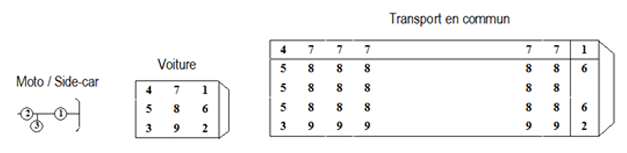

# Brooklyn nine-nine - Projet IA26

## Contexte 💥
La sécurité routière demeure une contrainte majeure des pouvoirs publics. Chaque année, des milliers d'accidents corporels (un accident survenu sur une voie ouverte à la circulation publique, impliquant au moins un véhicule et ayant fait au moins une victime ayant nécessité des soins) surviennent sur les routes, entraînant des blessures graves, des handicaps ou des décès. Pour mieux prévenir ces drames et optimiser les interventions des services de secours, il est essentiel de comprendre les facteurs qui influencent la gravité des accidents.

## Problématique ✨
L'objectif du projet est donc de concevoir un modèle de prédiction capable d'estimer le niveau de gravité d'un accident corporel, à partir de données disponibles avant ou immédiatement après l'événement en exploitant des données historiques d'accidents (lieux, conditions météorologiques, véhicules impliqués, profils des usagers de la route...). Ce modèle pourra, à terme, être utilisé pour prioriser les interventions de secours, orienter les campagnes de prévention et soutenir les politiques publiques en matière d'aménagement et de régulation du trafic.

## Méthodologie de travail 🤓

Ceci est un problème de régression ou de classification. Niveau de gravité :

1 : indemne

2 : blessé léger

3 : blessé hospitalisé

4 : tué

### Nos données

Nous disposons du set de données "Accidents corporels de la circulation routière" de l'Observatoire national interministériel de la sécurité routière. Un accident corporel est un accident survenu sur une voie ouverte à la circulation publique, impliquant au moins un véhicule et ayant fait au moins victime ayant nécessité des soins.

Ces bases de données répertorient l'intégralité des accidents corporels de la circulation, survenus durant une année précise entre 2005 et 2023 en France métropolitaine et dans les départements et territoires d'Outre-mer, avec une description simplifiée. Cela comprend des informations de localisation de l'accident, des informations concernant les caractéristiques de l'accident et son lieu, les véhicules impliqués et leurs victimes. La base de données de chaque année est composée de 4 fichiers : Caractéristiques (circonstances générales de l’accident), Lieux (description du lieu principal de l’accident), Véhicules et Usagers au format csv.

### Préparation de nos données

Nous avons choisi de conserver les données de 2021 à 2023 pour nos ensembles d’apprentissage et de tests afin d’être au plus proche des habitudes des personnes pour un premier modèle. Nous n’avons pas choisi d’entraîner notre modèle sur seulement d’anciennes données pour éviter l’apparition d’un Concept Drift. Ceci représente 419 650 lignes.

Étape 1 : Concaténation des données entre 2021 et 2023 pour chaque type de table

Étape 2 : Fusionner les 4 tableaux dans une seule database

Étape 3 : Création de la matrice de corrélation
On observe entre autres que :
- la place de l’usager dans le véhicule est corrélée au type de véhicule ;
- les features concernant les piétons présents sont corrélées ;
- la vitesse maximale autorisée est fortement corrélée à la catégorie de route et si nous sommes dans une agglomération ou pas.

Étape 4 : Sélection des colonnes pertinentes pour la prédiction à l’aide de la matrice de corrélation et afin que ces features puissent être données à l’oral au secours sur le lieu de l’accident

Étape 5 : Revue du format de certaines colonnes (prep_data.py)

Étape 6 : Création des fonctions one hot, normalisation et suppression des lignes incomplètes.

Au final, on obtient 319 235 lignes ; ceci est un très bon nombre pour entraîner un modèle.

### Choix des classifieurs et métriques

#### Random Forest

#### Réseau de neurones

### Simulation d'appel

Ce programme simule un accident de la route en recueillant des données sur l'incident (position de l'usager, véhicule, conditions de la route...), les mêmes que nos données post-traitements et prédit les résultats avec les modèles décrits précédemment. Après prétraitement des données, on utilise un classifieur pour prédire la nature de l'accident, un modèle de régression pour estimer l'ampleur des dommages et un réseau de neurones. Les résultats permettent d'analyser le scénario de l'accident et d'orienter les actions à prendre.

### Documentation

Place occupée par l'usager dans le véhicule au moment de l'accident :

Catégorie du véhicule :

00 – Indéterminable 

01 – Bicyclette 

02 – Cyclomoteur <50cm3

03 – Voiturette (Quadricycle à moteur carrossé) (anciennement "voiturette ou tricycle à moteur")

07 – VL seul 

10 – VU seul 1,5T <= PTAC <= 3,5T avec ou sans remorque (anciennement VU seul 1,5T <= PTAC <= 3,5T)

13 – PL seul 3,5T <= 7,5T 

14 – PL seul > 7,5T 

15 – PL > 3,5T + remorque 

16 – Tracteur routier seul 

17 – Tracteur routier + semi-remorque 

20 – Engin spécial 

21 – Tracteur agricole 

30 – Scooter < 50 cm3 

31 – Motocyclette > 50 cm3 et <= 125 cm3 

32 – Scooter > 50 cm3 et <= 125 cm3 

33 – Motocyclette > 125 cm3 

34 – Scooter > 125 cm3 

35 – Quad léger <= 50 cm3 (Quadricycle à moteur non carrossé) 

36 – Quad lourd > 50 cm3 (Quadricycle à moteur non carrossé) 

37 – Autobus 

38 – Autocar 

39 – Train 

40 – Tramway 

41 – 3RM <= 50 cm3 

42 – 3RM > 50 cm3 <= 125 cm3 

43 – 3RM > 125 cm3 

50 – EDP à moteur 

60 – EDP sans moteur 

80 – VAE

Obstacle fixe heurté :

0 – Sans objet 

1 – Véhicule en stationnement 

2 – Arbre 

3 – Glissière métallique 

4 – Glissière béton 

5 – Autre glissière 

6 – Bâtiment, mur, pile de pont 

7 – Support de signalisation verticale ou poste d’appel d’urgence 

8 – Poteau 

9 – Mobilier urbain 

10 – Parapet 

11 – Ilot, refuge, borne haute 

12 – Bordure de trottoir 

13 – Fossé, talus, paroi rocheuse 

14 – Autre obstacle fixe sur chaussée 

15 – Autre obstacle fixe sur trottoir ou accotement

16 – Sortie de chaussée sans obstacle 

17 – Buse – tête d’aqueduc

Manoeuvre principale avant l’accident :

0 – Inconnue 

1 – Sans changement de direction 

2 – Même sens, même file

3 – Entre 2 files 

4 – En marche arrière

5 – A contresens 

6 – En franchissant le terre-plein central 

7 – Dans le couloir bus, dans le même sens 

8 – Dans le couloir bus, dans le sens inverse 

9 – En s’insérant 

10 – En faisant demi-tour sur la chaussée

Changeant de file 

11 – A gauche 

12 – A droite

Déporté

13 – A gauche

14 – A droite 

Tournant 

15 – A gauche 

16 – A droite 

Dépassant 

17 – A gauche 

18 – A droite 

Divers 

19 – Traversant la chaussée 

20 – Manœuvre de stationnement 

21 – Manœuvre d’évitement 

22 – Ouverture de porte 

23 – Arrêté (hors stationnement)

24 – En stationnement (avec occupants)

25 – Circulant sur trottoir 

